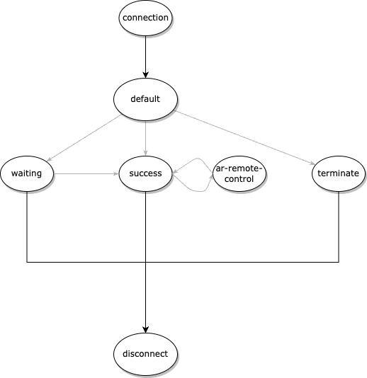

## Overview
1. webXR remote controller via websocket network
2. support only one channel with two users at each ends
3. with nodeJS websocket api (socket.io, socket.io-client)

## Detail 
A simple implemantion of the socket channel capable of 2 users. users not on the channel have to wait in the queue to get access to it

## Implementation
A socket can have 5 different states/event
- default : after the first socket connection 
- success : when socket successfully enters the channel
- waiting : when socket has to wait becasue channel is fully occupied 
- ar-remote-control : socket is communicating 
- terminate : when the waiting queue reached its maximum capacity. this leads to the disconnection of the socket

## How it works 
https://www.youtube.com/watch?v=icS4_gEXGcQ

## Further plans for update
As of 6 July 2023
- support for fetching data when the channel is re-estbailished
- support for multiple channels 
